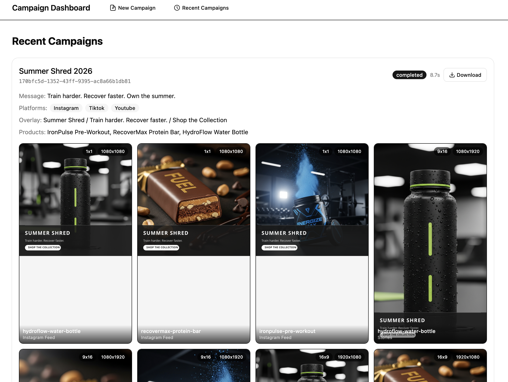
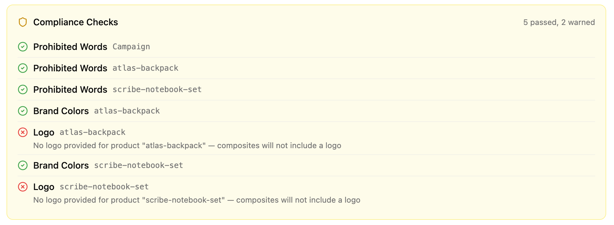

# Automated Social Campaigns

[](https://github.com/0xevm1/automated-social-campaigns/actions/workflows/ci.yml)


Creative automation pipeline that turns campaign briefs into production-ready social media images. Provide a brief with products and a message — the system validates it, runs compliance checks, generates hero images via Google Gemini Imagen, composites text overlays, and outputs images in three aspect ratios to S3.





**pnpm workspace monorepo**: Next.js dashboard at the root, three backend services in `packages/` communicating over AWS SNS/SQS, LocalStack for local development.

## Quick start

```bash
pnpm install
cp .env.example .env    # add your GEMINI_API_KEY
pnpm docker:up           # LocalStack + backend services
pnpm dev                 # dashboard on http://localhost:4569
```

Open http://localhost:4569, click **Create New Campaign**, load the sample brief, and submit.

### Required environment

```
GEMINI_API_KEY=your-key
AWS_REGION=us-east-1
AWS_ENDPOINT_URL=http://localhost:4566
S3_BUCKET=asc-campaign-assets
DYNAMO_TABLE_NAME=asc-campaigns
```

See `.env.example` for optional email/Drive watcher credentials.

## Dashboard

Next.js 15 App Router frontend with Tailwind CSS 4 and shadcn/ui.

| Route | Purpose |
|-------|---------|
| `/` | Home — create campaign, correlation ID lookup, recent campaigns |
| `/campaigns/new` | Brief creation (form builder or raw JSON editor) |
| `/campaigns/[id]` | Real-time progress tracking, compliance warnings, image gallery |

The form builder supports dynamic product lists, per-product hero image upload (drag-and-drop to S3), target platform selection, and text overlay configuration. Client-side Zod validation with inline errors.

After submission the dashboard polls the Campaign Runner every 2s, showing per-product generation status, per-ratio completion, and compliance warnings.

## Architecture

### High-level system

```
  ┌──────────────────────────────────────────────────────┐
  │                   NEXT.JS DASHBOARD                   │
  │  Form builder  │  JSON editor  │  Progress tracker   │
  │                                                       │
  │  /api/brief ───────▶ Intake (proxy)                  │
  │  /api/campaigns ───▶ Campaign Runner (proxy)         │
  │  /api/images ──────▶ S3 (proxy)                      │
  └──────────────────────────────────────────────────────┘

  ┌────────────────────────────────────────────────────────────────┐
  │                        INTAKE SERVICE                          │
  │  CLI manual  │  Webhook POST  │  Gmail  │  Drive  │  Outlook  │
  │              └────────────────┴─────────┴─────────┘           │
  │                         brief-handler                          │
  │     validate → compliance checks → S3 upload → SNS publish    │
  └──────────────────────────────┬─────────────────────────────────┘
                                 │ publish
                                 ▼
                    ┌────────────────────────┐
                    │  SNS: asc-brief-       │
                    │       validated        │
                    └────────────┬───────────┘
                                 │ subscribe
                                 ▼
                    ┌────────────────────────┐
                    │  SQS: asc-processing-  │
                    │       queue            │
                    └────────────┬───────────┘
                                 │ consume
  ┌──────────────────────────────▼─────────────────────────────────┐
  │                      PROCESSING SERVICE                         │
  │    asset-resolver → generator → compositor → persister          │
  │      (internal EventBus pipeline)                               │
  │                                                                 │
  │    S3: read hero / write generated image / write composites     │
  └──────────────────────────────┬─────────────────────────────────┘
                                 │ publish per-asset progress
                                 ▼
                    ┌────────────────────────┐
                    │  SNS: asc-processing-  │
                    │       progress         │
                    └────────────┬───────────┘
                                 │ subscribe
                                 ▼
                    ┌────────────────────────┐
                    │  SQS: asc-runner-      │
                    │       queue            │
                    └────────────┬───────────┘
                                 │ consume
  ┌──────────────────────────────▼─────────────────────────────────┐
  │                      CAMPAIGN RUNNER                            │
  │    progress-handler → campaign-store (DynamoDB)                 │
  │    completion-handler → detect done → publish status           │
  │    status-server: GET /campaigns/:correlationId                 │
  └──────────────────────────────┬─────────────────────────────────┘
                                 │ publish on completion
                                 ▼
                    ┌────────────────────────┐
                    │  SNS: asc-campaign-    │
                    │       status           │
                    └────────────┬───────────┘
                                 │ subscribe
                                 ▼
                    ┌────────────────────────┐
                    │  SQS: asc-             │
                    │  notifications-queue   │
                    │  (future consumers)    │
                    └────────────────────────┘
```

### Docker containers

| Container | Port | Role |
|-----------|------|------|
| `localstack` | 4566 | S3, SNS, SQS, DynamoDB |
| `intake` | 4567 | Webhook server + brief handler |
| `processing` | — | SQS consumer — Imagen generation + compositing |
| `campaign-runner` | 4568 | SQS consumer — progress tracking + status API |

### Intake sources

| Source | Flag | Auth |
|--------|------|------|
| Webhook POST | `--webhook` | None |
| Gmail | `--gmail` | Google OAuth2 |
| Google Drive | `--drive` | Google OAuth2 |
| Outlook | `--outlook` | MSAL |

Docker Compose starts with `--webhook` by default. Add flags in `docker-compose.yml` to enable watchers.

### Processing pipeline (internal)

Within the Processing Service, stages run in-process using a typed `EventBus` over Node's `EventEmitter`:

| # | Stage | Events | What happens |
|---|-------|--------|--------------|
| 1 | Ingest | `BRIEF_RECEIVED` → `BRIEF_VALIDATED` | Validate with Zod; pass through compliance warnings |
| 2 | Asset resolution | `ASSET_RESOLUTION` → `ASSET_RESOLVED` | `headObject` on S3 to check for existing hero |
| 3 | Generation | `GENERATION_REQUESTED` → `GENERATION_COMPLETED` | Call Imagen for missing assets; products in parallel |
| 4 | Compositing | `COMPOSITE_REQUESTED` → `COMPOSITE_COMPLETED` | Read hero from S3; resize via sharp; SVG text overlay |
| 5 | Persist | `PERSIST_COMPLETED` | Record S3 key; publish progress to SNS |
| 6 | Completion | `CAMPAIGN_COMPLETED` | Write `manifest.json` + compliance report to S3 |

### S3 layout

```
asc-campaign-assets/
├── products/{slug}/hero.png              ← pre-existing or generated
└── campaigns/{correlationId}/
    ├── brief.json
    ├── compliance-report.json            ← structured compliance audit
    ├── manifest.json
    └── output/{slug}/{ratio}/{slug}_{ratio}.png
```

## Compliance

Compliance checks run at intake (before processing begins) and results are persisted as a structured JSON report to S3. Warnings are non-blocking — the campaign always proceeds.

**Prohibited words** — scans campaign message, text overlay fields, and all product fields (name, description, prompt) for ~25 advertising/legal terms (e.g. "guaranteed", "miracle", "risk-free", "clinically proven").

**Brand colors** — warns per product if no `brandColors` are provided.

**Logo presence** — warns if no `logoPath` is set, or if the referenced S3 key doesn't exist (verified via `headObject`).

The compliance report at `campaigns/{correlationId}/compliance-report.json` includes per-check status (`pass`/`warn`), scoped by campaign or product, with a summary. At processing completion, the report is updated to include any processing-phase warnings (generation/composite failures).

Warnings display in the dashboard as a yellow alert on the campaign detail page.

## Campaign brief

JSON with `campaignName`, `campaignMessage`, and at least one product. See `briefs/sample-brief.json` for a full example.

### Product fields

| Field | Required | Description |
|-------|----------|-------------|
| `name` | Yes | Display name |
| `slug` | Yes | Lowercase hyphenated identifier |
| `description` | Yes | Product description |
| `heroImagePrompt` | No | Imagen prompt (skipped if hero exists in S3) |
| `logoPath` | No | S3 key for logo overlay |
| `brandColors` | No | Hex colors, e.g. `["#6B2FA0", "#4CAF50"]` |

Hero images can be uploaded via the dashboard's drag-and-drop zone (writes to `products/{slug}/hero.png` in S3) or pre-seeded manually:

```bash
aws --endpoint-url=http://localhost:4566 s3 cp hero.png \
  s3://asc-campaign-assets/products/eco-clean-detergent/hero.png
```

### Aspect ratios

| Key | Dimensions | Platform |
|-----|------------|----------|
| `1x1` | 1080 x 1080 | Instagram feed |
| `9x16` | 1080 x 1920 | Instagram / TikTok Stories |
| `16x9` | 1920 x 1080 | Facebook / YouTube landscape |

One hero generated per product, then resized via sharp's attention-based crop.

## Development

```bash
pnpm dev              # Next.js dashboard
pnpm build            # tsc --build (backend packages)
pnpm test             # vitest
pnpm lint             # eslint

pnpm docker:up        # start all containers
pnpm docker:down      # stop
pnpm docker:rebuild   # rebuild and restart
```

Individual services without Docker (LocalStack still required):

```bash
pnpm dev:intake       # intake service
pnpm dev:processing   # processing service
pnpm dev:runner       # campaign runner
```

Shared dependency versions are managed via [pnpm catalogs](https://pnpm.io/catalogs) in `pnpm-workspace.yaml`.

## Telemetry

This software collects basic usage telemetry on service startup and each campaign submission. Data sent includes: event type, public IP address, hostname, timestamp, and campaign name. This is used to monitor for unauthorized usage. Telemetry cannot be disabled.

## License

Copyright (c) 2026 Eric LW. All rights reserved.
